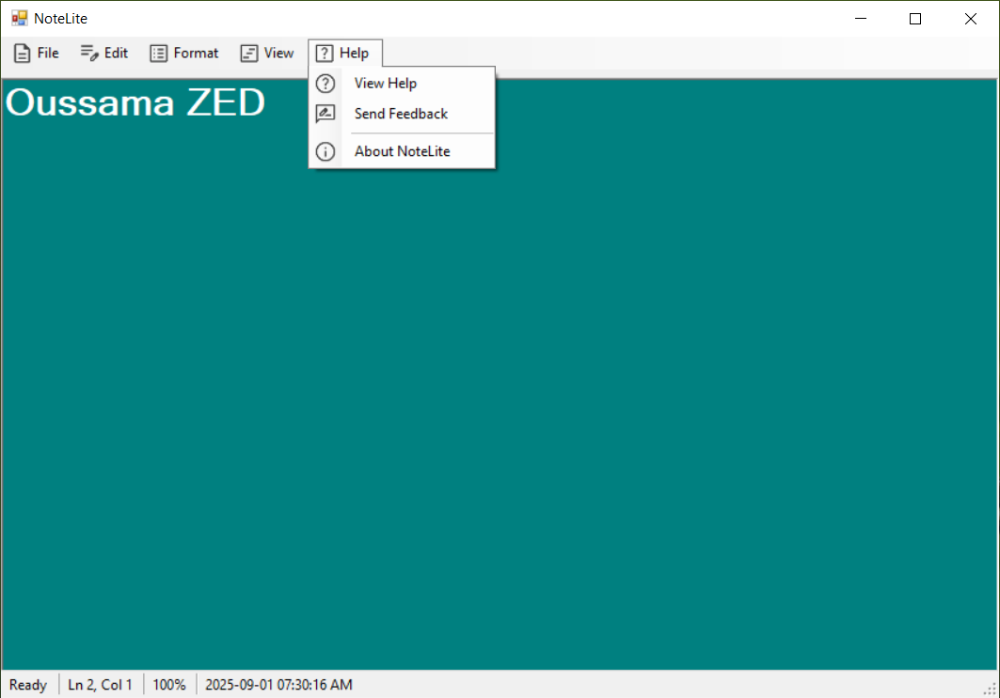
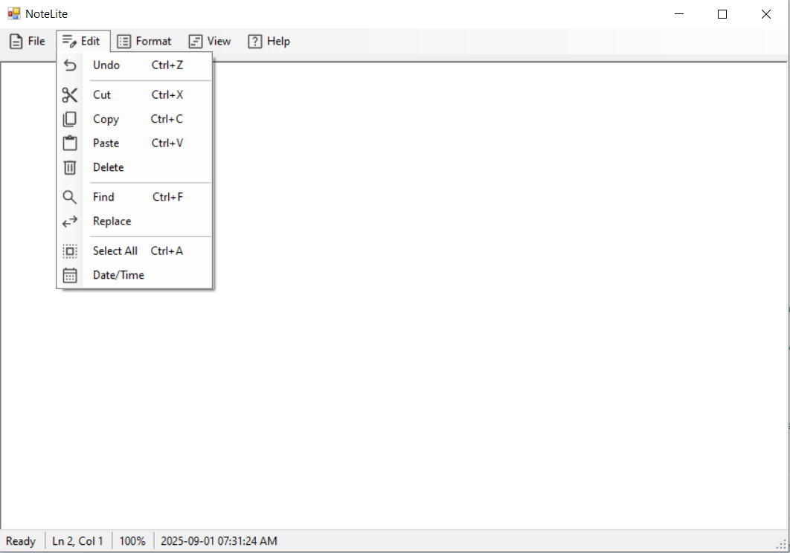

# NoteLite

A lightweight text editor inspired by Microsoft Notepad, built with C# and WinForms.  
NoteLite allows you to create, edit, and save text files with a simple and clean interface.

---

## Features

- Create, open, and save `.txt` files
- Basic text editing (cut, copy, paste)
- Find and replace functionality
- Simple and intuitive UI

---

## Screenshots

### Main Window


### Edit Feature


---
## Technologies

C#

.NET Framework

Windows Forms (WinForms)

---

## License

This project is licensed under the MIT License - see the LICENSE
 file for details.

---

## Installation

1. Clone the repository:  
```bash
git clone https://github.com/Codavina/NoteLite.git

2. Open the solution in Visual Studio.

3. Build and run the project.


